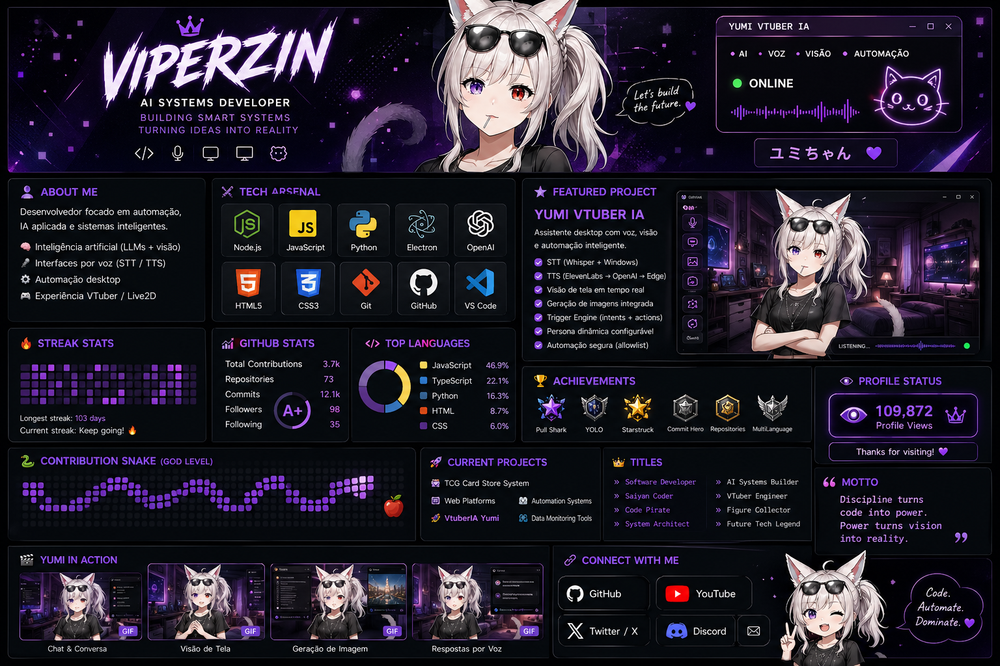
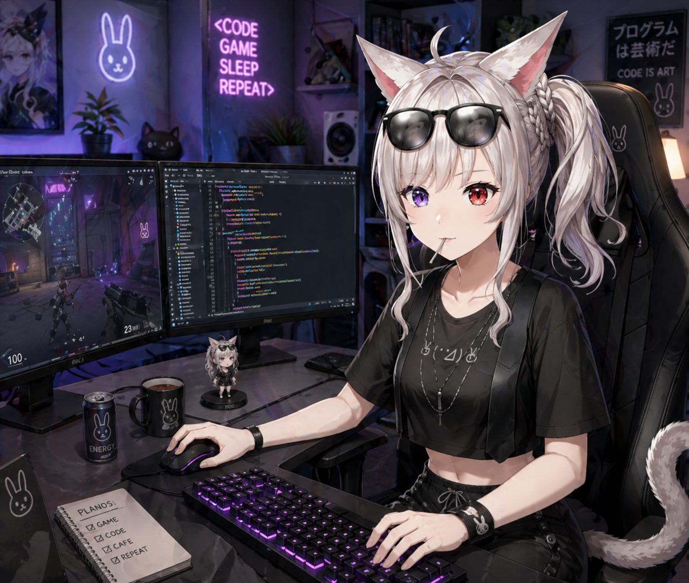

<h1 align="center">👑 Viperzin</h1>

<p align="center">
  
</p>

<p align="center">

</p>

<h3 align="center"> Software Developer | AI Systems | Figure Collector</h3>

---

# About Me

Desenvolvedor focado em **automação, IA aplicada e sistemas inteligentes**.

* Inteligência artificial
* Interfaces por voz
* Automação desktop
* VTuber / Live2D systems

---

# Tech Arsenal

<p align="center">


</p>

---

# Yumi In Action (LIVE)

<p align="center">
  
</p>

---

# Activity & Performance

<p align="center">
  
  
</p>

<p align="center">
  
</p>

---

# Achievements

<p align="center">
  
</p>

---

# Contribution Snake (GOD LEVEL)

<p align="center">
  
</p>

---

# Current Projects

* 🤖 VtuberIA Yumi (AI + Voice + Automation)
* 🛒 TCG Card Store System
* 🌐 Web Platforms
* ⚙️ Automation Systems
* 📊 Data Monitoring Tools

---

# 🧬 Titles

```diff
+ Software Developer
+ Saiyan Coder
+ Code Pirate
+ System Architect
+ AI Systems Builder
+ VTuber Engineer
+ Automation Architect
+ Figure Collector
+ Future Tech Legend
```

---

# 🧠 Motto

```
Discipline turns code into power.
Power turns vision into reality.
```

---

# 👁️ Profile Status

<p align="center">

</p>

---

<!-- END -->
